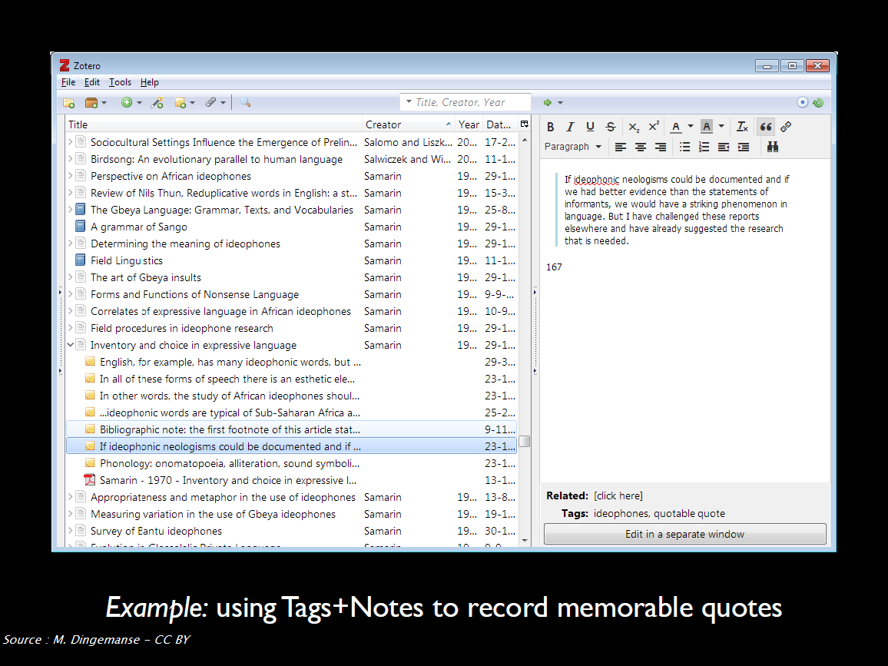

# Gérer facilement sa bibliographie avec Zotero : cours

L'ensemble de ce document est  partiellement traduit et adapté de :

Dingemanse, M. (2018, mars). Collecting, organizing and citing scientific literature : An intro to Zotero. Repéré à https://speakerdeck.com/markding/collecting-organizing-and-citing-scientific-literature-an-intro-to-zotero [sous licence CC-BY]

## 1. Introduction

### Peut-être procédez-vous de la façon suivante?

#### Etape 01 : collecter la biblio

****

#### Etape 02 : organiser la biblio

****

#### Etape 03 : citer ses sources

****

### Et peut-être rencontrez-vous aussi les difficultés suivantes?

* Des tas de PDF en vrac avec des noms incompréhensibles
* Aucun lien entre vos références bibliographique, vos fichiers et vos notes
* Le copier-coller comme meilleure option lorsque vous effectuez des citations
* La nécessité de remettre en forme manuellement vos références

Bref :

En version animée :

Ciel mon doctorat ! (2019). Quand tu découvres enfin toute la puissance de Zotero après de longs mois de résistance. _Ciel mon doctorat !_. Repéré à https://cielmondoctorat.tumblr.com/post/182190873430

ou encore :

Robles, J. S. (2019, 26 août). Me when I have to go back to writing to change the style &amp; references #AcademicLife https://t.co/tFYWKZAkVa [Twitter]. _@DoctorJRo_. Repéré à https://twitter.com/DoctorJRo/status/1166056789642625024

### Zotero?

## 2.  Installer et configurer Zotero

### Ressources 2

 [Documentation Zotero : Installation](https://www.zotero.org/support/fr/installation) - en :fr:

 [Documentation Zotero : Préférences](https://www.zotero.org/support/fr/preferences) - en :fr:

:warning: Les pages consacrées aux différents onglets des préférences ne sont pas toutes traduites en français.

### Configuration minimale recommandée

A ce stade, on se concentre sur les "Préférences > Générales".

#### Rubrique "Gestion des fichiers"

* Décochez la case "Faire une capture automatique de la page lors de la création de documents à partir de pages Web", pour éviter d'encombrer votre bibliothèque avec des captures de toutes les pages Web que vous enregistrerez.
* Cochez la case "Joindre automatiquement les fichiers PDF associés lors de l'enregistrement d'un document", pour récupérer automatiquement les PDFs des articles lorsque vous êtes sur le site d'un éditeur ou tout autre site sur lequel le PDF est présent. Si vous êtes sur PubMed, Scopus ou une autre base de données bibliographiques, il faudra suivre le lien vers le site de l'éditeur pour enregistrer la référence bibliographique + le PDF de l'article. Et il faudra bien sûr, s'il s'agit d'une ressource payante, que votre institution soit abonnée.
* Cochez la case "Récupérer automatiquement les métadonnées des PDF".

#### Rubrique "Divers"

Décochez la case "Ajouter automatiquement aux documents des marqueurs à partir des mots-clés fournis" pour éviter de parasiter votre liste de marqueurs personnels avec tous les mots-clés associés aux documents que vous enregistrez. Variables en fonction de la source dont ils proviennent (mots-clés auteur, indexation sujet des catalogues de bibliothèque, etc.), ces termes accumulés peuvent en effet finir par produire une liste de terme redondants (synonymes, variantes diverses d'un même mot) .

## 3.  Constituer sa bibliothèque Zotero : importer des références bibliographiques depuis diverses sources (bases de données en ligne, catalogues de bibliothèque, fichiers PDF, etc.) et leur associer des fichiers joints

### Ressources - 3
 [Documentation Zotero : Ajouter des documents à Zotero](https://www.zotero.org/support/fr/adding_items_to_zotero) - en :fr:

 [Documentation Zotero : Ajouter des fichiers à votre bibliothèque Zotero](https://www.zotero.org/support/fr/attaching_files) - en :fr:

 [Documentation Zotero : Récupérer les métadonnées des PDF](https://www.zotero.org/support/fr/retrieve_pdf_metadata) - en :fr:

Billet du blog Zotero francophone : [Nettoyer les références collectées, quelques astuces](https://zotero.hypotheses.org/760)

### Enregistrer des documents dans votre navigateur

Que vous cherchiez à localiser un article déterminé ou que vous effectuiez une recherche plus générale, vous commencez probablement par chercher en ligne dans Google Scholar, PubMed, le Sudoc, etc.

Cela correspond à la méthode à la fois la plus simple, la plus courante et la plus recommandée pour ajouter des documents dans Zotero.

#### Exercice 3a

:gear: :pencil: Nous prenons **10 minutes** pour cette activité : enregistrez dans votre bibliothèque des documents depuis les sites que vous utilisez habituellement.

### Vérifier et mettre à jour les documents que vous avez enregistrés

Quelle que soit la méthode que vous utilisez pour ajouter des documents dans votre bibliothèque, il peut y avoir des coquilles à corriger ou des informations à ajouter.

#### Recommandation 1 : choisir la bonne source

Privilégiez les sources fiables et exhaustives pour créer ou compléter vos documents, c'est-à-dire :
* les sites d'éditeur et les bases de données bibliographiques pour les articles de revue et les chapitres de livre (SpringerLink, Scopus, etc. // évitez Google Scholar),
* les catalogues de bibliothèques pour les livres (Sudoc, WorldCat // évitez amazon).

#### Recommandation 2 : anticiper les normes

Renseignez-vous sur les exigences minimales en termes de rédaction bibliographique de votre domaine de recherche. Faut-il pour chaque livre enregistrer les dates, lieu et éditeur commerciaux originaux? Si oui, recherchez-les et enregistrez-les en même temps que vous créez le document dans votre bibliothèque Zotero.

#### Recommandation 3 : ne pas procrastiner

Procédez aux ajouts et modifications tout de suite! Tant que vous avez le document sous la main et/ou que vous avez l'information à portée de clic.

#### Exercice 3b

:gear: :pencil: Nous prenons **15 minutes** pour cette activité ; vous travaillez à 2 avec votre voisin.

Importez dans Zotero le fichier `gerer_biblio_zotero_tp_import.rdf` disponible dans le dossier de partage.

Apportez toutes les modifications qui vous semblent nécessaires aux documents.

## 4. Organiser sa bibliothèque Zotero : collections, marqueurs, recherches enregistrées, etc.

Indépendamment du logiciel utilisé et de la volumétrie à considérer, voici les principales caractéristiques souhaitables pour une bibliothèque.

* Elle offre de nombreux moyens de recherche et de navigation.
* Elle comporte des informations bibliographiques de référence, complètes et exactes.
* Elle facilite l'étude et la prise de notes.

### Ressources 4

 [Documentation Zotero : Détection des doublons](https://www.zotero.org/support/fr/duplicate_detection) - en :fr:

 [Documentation Zotero : Collections and Tags](https://www.zotero.org/support/collections_and_tags) - en :gb:, la version :fr: n'existe pas encore

 [Documentation Zotero : Rechercher](https://www.zotero.org/support/fr/searching) - en :fr:

 [Documentation Zotero : Tri](https://www.zotero.org/support/fr/sorting) - en :fr:

 [Documentation Zotero : Notes](https://www.zotero.org/support/fr/notes) - en :fr:

 [Documentation Zotero : Related](https://www.zotero.org/support/related) - en :gb:, la version :fr: n'existe pas encore

Billet du blog Zotero francophone : [Comment organiser sa bibliothèque?](https://zotero.hypotheses.org/756)

### Exemples

Gruson-Daniel, C. (2016, novembre). Atelier #05 : La biblio, c’est fantastique !  : Découverte de Zotero. _HackYourPhd [GitHub]_. Repéré à https://github.com/HackYourPhd/ateliers-open-geek/blob/master/Atelier_05_biblio_zotero/Atelier_05.md

Muller, C. (2018, 4 mars). Cinq ans d’usage de Zotero, un bilan [Billet]. _Acquis de conscience_. Repéré à https://consciences.hypotheses.org/1184

## 5. Identifier et installer dans Zotero les styles bibliographiques de référence de sa discipline

### Ressources - 5

 [Documentation Zotero : Les styles bibliographiques](https://www.zotero.org/support/fr/styles) - en :fr:

 [Documentation Zotero : Préférences > Citer](https://www.zotero.org/support/fr/preferences/cite) - en :fr:

### Les types de style bibliographique

Un style bibliographique définit la façon dont les éléments bibliographiques d’un document :

*   appels de citation,
*   **notes** si applicable,
*   **bibliographie**,

doivent être organisés et mis en forme.

On distingue différents types de style bibliographiques, correspondant à des formats de style Zotero différents. On trouve ainsi dans [l'entrepôt des styles Zotero](https://www.zotero.org/styles), près de 9000 styles regroupés en 2 grands ensembles :

*   les styles _**in-text**_, dans lesquels un appel de citation dans le texte renvoie à une entrée de la bibliographie,
*   les styles _**note**_, dans lesquels un marqueur (symbole, nombre, etc.) pointe vers une note de bas de page ou de fin, qui permet d’identifier le document cité.

#### Les styles _in-text_ : numériques
Dans le texte : chaque référence citée est appelée par un **numéro**.

>Yeast cells were grown at 25°C in batch cultures on 0.5% methanol for 36 hours [21, 22].

Dans la bibliographie : les références sont classées par **ordre d’apparition dans le texte**.

>21\. Zwart KB, Veenhuis M, Harder W (1983) Significance of yeast peroxisomes in the metabolism of choline and ethanolamine. Antonie Van Leeuwenhoek 49: 369-385.
>
>22\. van der Klei IJ, Harder W, Veenhuis M (1991) Methanol metabolism in a peroxisome-deficient mutant of Hansenula polymorpha: a physiological study. Arch Microbiol 156: 15-23.

#### Les styles  _in-text_ : numériques composites
Les styles numériques composites, dans lesquels une entrée bibliographique peut contenir plusieurs références, sont très utilisés en chimie.

**Ce type de style n'est pas pris en charge par CSL, le langage dans lequel sont écrits les styles bibliographiques utilisés par Zotero.**

Dans le texte :

>Yeast cells were grown at 25°C in batch cultures on 0.5% methanol for 36 hours (1)

Dans la bibliographie :

>1\. a) Zwart KB, et al. (1983) Antonie van Leeuwenhoek 49: 369-385, b) van der Klei IJ, et al. (1991) Arch Microbiol 156: 15-23.

#### Les styles  _in-text_ : auteur et auteur-date
Dans le texte : chaque référence citée est appelée par le **nom de l'auteur** ou **le nom de l'auteur et la date de publication**.

> Yeast cells were grown at 25°C in batch cultures on 0.5% methanol for 36 hours (van der Klei et al. 1991; Zwart et al. 1983)
>
>Yeast cells were grown at 25°C in batch cultures on 0.5% methanol for 36 hours (van der Klei et al.; Zwart et al.)</cite>

Dans la bibliographie : les références sont classées par **ordre alphabétique d'auteur**.

>van der Klei IJ, Harder W, Veenhuis M (1991) Methanol metabolism in a peroxisome-deficient mutant of Hansenula polymorpha: a physiological study. Arch Microbiol 156: 15-23.
>
>Zwart KB, Veenhuis M, Harder W (1983) Significance of yeast peroxisomes in the metabolism of choline and ethanolamine. Antonie Van Leeuwenhoek 49: 369-385.

#### Les styles  _in-text_ : label
Dans le texte : chaque référence citée est appelée par un **code**.

>Yeast cells were grown at 25°C in batch cultures on 0.5% methanol for 36 hours [ZwVH1983; vaHV1991].</cite>

Dans la bibliographie : les références sont classées par **ordre d’apparition dans le texte**.

>[ZwVH1983] Zwart KB, Veenhuis M, Harder W (1983) Significance of yeast peroxisomes in the metabolism of choline and ethanolamine. Antonie Van Leeuwenhoek 49: 369-385.
>
>[vaHV1991] van der Klei IJ, Harder W, Veenhuis M (1991) Methanol metabolism in a peroxisome-deficient mutant of Hansenula polymorpha: a physiological study. Arch Microbiol 156: 15-23.

Un seul style correspond à ce modèle dans l'entrepôt des styles, le style [DIN 1505-2 (alphanumeric, German)](https://www.zotero.org/styles/din-1505-2-alphanumeric).
Il présente 2 limites :

* il est monolingue en allemand,
* le schéma de construction du label ne peut pas être modifié.

Un label personnalisé peut être défini, mais cela devra être fait manuellement pour chaque référence.

* Pour chaque référence le label à utiliser devra être indiqué dans le champ _Extra_ de la notice Zotero, sous la forme : `citation-label: valeur_du_label`.
* Par conséquent, il faudra **désambiguïser** manuellement des labels qui seraient identiques mais se rapporteraient à des articles différents (même premier auteur et même année).

#### Les styles _note_
Dans le texte :

>"In the Island of St. Kilda, according to Martin, [*] the men do not acquire beards until the age of thirty or upwards, and even then the beards are very thin. “
>
>[*]'Voyage to St. Kilda' (3rd edit. 1753), p. 37.

Dans la bibliographie : certains styles _note_ incluent une bibliographie de tous les documents cités. Les références sont en général classées **par ordre alphabétique d'auteur**.

Le format du marqueur doit être paramétré dans le **traitement de texte**.

**Exemple dans Word 2010**

### Comment choisir un style bibliographique lorsqu'aucun n'est imposé?

Les critères de choix suivants peuvent être pris en compte.

#### Existence d'un modèle de référence
Existe-t-il un style de référence ou fréquemment utilisé dans votre domaine? Par exemple "Vancouver" et "American Psychological Association" pour les sciences de la santé, "Modern Language Association" pour certaines domaines de la littérature, "IEEE" pour les sciences de l'ingénieur, etc.

#### Typologie documentaire prise en charge
Citez-vous de nombreux types de documents différents? Tous les styles ne prennent pas en charge tous les types de documents. Le style _Nature_, par exemple, ne sera pas le plus adapté si vous citez des documents non publiés comme les thèses. La revue _Nature_ demande aux auteurs de citer un nombre restreint de types de document (voir les [instructions aux auteurs](http://www.nature.com.docelec.u-bordeaux.fr/nature/for-authors/formatting-guide), rubrique _References_), aussi le style CSL pour Zotero _Nature_ encode-t-il la mise en forme des citations uniquement pour ces types de document.

#### Langue de rédaction
Rédigez-vous seulement en français? Seulement dans une autre langue? Dans différentes langues selon les cas? Si certains styles sont agnostiques du point de vue de la langue, d'autres ont au contraire une langue prédéfinie qui ne peut pas être modifiée. Ainsi le style _Nature_ est-il paramétré uniquement pour la langue anglaise, selon la norme britannique.

Tous les styles "localisés" pour une langue autre que l'anglais comporte le nom de cette langue dans leur intitulé. Ainsi, rechercher **french** dans l'entrepôt des styles Zotero affichera uniquement les styles localisés pour la langue française. Les styles sans mention de langue sont soit "localisés" en anglais, soit agnostiques du point de vue de la langue.

## 6. Exploiter sa bibliothèque Zotero : rédaction bibliographique, modules Zotero pour Word et LibreOffice, Zotero et LaTeX, etc.

Ce que fait Zotero :
* mettre en forme automatiquement les citations et les bibliographies,
* en respectant de façon infaillible et minutieuse les règles de tyographie et de ponctuation,
* en triant correctement toutes les entrées de la bibliographie.

Il vous évite ainsi d'effectuer ces tâches répétitives pour vous permettre de vous concentrer sur les apects de la citation qu'il ne prend pas en charge :
* la sélection des documents à citer,
* la complétude et l'exactitude des informations bibliographiques à indiquer.

### Ressources - 6

 [Documentation Zotero : Créer des bibliographies](https://www.zotero.org/support/fr/creating_bibliographies) - en :fr:

 [Documentation Zotero : Modules de traitement de texte](https://www.zotero.org/support/fr/word_processor_integration) - en :fr:

Si vous utilisez d'autres logiciels que Word ou LibreOffice :
* Billet du blog Zotero francophone : [Zotero et LaTeX](https://zotero.hypotheses.org/762)
* Billet du blog Zotero francophone : [Markdown et Zotero](https://zotero.hypotheses.org/2258)

### Exercice 6

:gear: :pencil:
Nous prenons **15 minutes** pour cette activité ; vous travaillez à nouveau à 2 avec votre voisin.

A partir des documents de la bibliothèque Zotero importés et nettoyés précédemment et du fichier Word mis à votre disposition sur le dossier de partage, vous devez produire le même résultat que le texte rédigé imprimé distribué.

Le style bibliographique utilisé est un style auteur-date, le style **Elsevier - Harvard (with titles)**.

## 7. Où vont vos données Zotero?

 [Documentation Zotero : Le répertoire de données Zotero](https://www.zotero.org/support/fr/zotero_data) - en :fr:

:warning: 2 points de vigilance :
* Assurez-vous que le répertoire de données Zotero fait bien partie des données que vous sauvegardez automatiquement et régulièrement.
* Si vous avez un profil itinérant Windows, déplacez votre répertoire de données Zotero à un autre emplacement, comme dans l'exemple ci-dessous.

## 8.  Organiser sa bibliothèque Zotero : gestion des fichiers joints dans Zotero avec ZotFile

### Ressources - 8
Billet du blog Zotero francophone [ZotFile : un outil pour gérer vos PDF](https://zotero.hypotheses.org/2838)

## 9. Conclusion

> Zotero takes care of everything that makes you weep and curse when doing it manually
>
> It puts hair-splitting editors out of business and lets scientists focus on real work

> Zotero s'occupe de tout ce qui vous fait pleurer et maudire quand vous le faites manuellement.
>
> Il prive de travail les éditeurs pinailleurs et permet aux scientifiques de se concentrer sur le travail réel.

Source : Dingemanse, M. (2018, mars). Collecting, organizing and citing scientific literature : An intro to Zotero. Repéré à https://speakerdeck.com/markding/collecting-organizing-and-citing-scientific-literature-an-intro-to-zotero

### Zotero est un logiciel libre

Pourquoi est-ce important?

* Les utilisateurs peuvent contribuer au logiciel - voir [la liste complète des modules complémentaires à Zotero](https://www.zotero.org/support/https://www.zotero.org/support/plugins), et participer à la communauté des utilisateurs par le biais du [Forum Zotero](https://forums.zotero.org/)
* Le développement est agile et orienté vers les utilisateurs.
* Zotero est développé par une organisation à but non lucratif, sans intérêt financier pour vos données ; vous n'êtes pas obligé de créer un compte pour utiliser Zotero.

Vous trouverez davantage de détails et des exemples concernant cette questions dans le billet du blog Zotero francophone : [Pourquoi Zotero?](https://zotero.hypotheses.org/1998)

### Des questions?

* Lisez la **documentation**! Certaines pages sont disponibles uniquement en anglais, mais la documentation est exhaustive et détaillée. Nous vous recommandons comme point de départ la page d'accueil de la documentation en anglais : https://www.zotero.org/support/. Sur chacune des pages, la mention `fr` grisée ou noire vous indiquera si une version en français est disponible.
* Vous rencontrez une difficulté? Vous n'êtes probablement pas le premier ni le seul, consultez le **forum** et créez si besoin une nouvelle discussion : [Forum Zotero](https://forums.zotero.org/)
* Vos bibliothécaires sont là pour vous aider également.

Vous trouverez davantage de détails et des exemples concernant cette questions dans le billet du blog Zotero francophone : [Besoin d'aide?](https://zotero.hypotheses.org/1192)

# Crédits

 Ce document est mis à disposition selon les termes de la <a rel="license" href="http://creativecommons.org/licenses/by-sa/3.0/fr/">Licence Creative Commons Attribution -  Partage dans les Mêmes Conditions 3.0 France</a>.

**Auteur**

Frédérique Flamerie

**Visuels**

Site [Zotero](https://www.zotero.org/)
