# Gérer facilement sa bibliographie avec Zotero : support de cours

## Objectifs

* Créer et organiser une bibliothèque de références bibliographiques et de PDF avec Zotero
* Rédiger un document en générant automatiquement les citations et la bibliographie en fonction d'un style bibliographique
* Comprendre l'environnement de Zotero pour en optimiser et en augmenter l'usage

## Sommaire

0. Tour de table  
1. Introduction
2. Installer et configurer Zotero
3. Constituer sa bibliothèque Zotero étape 1, ajouter des documents et des fichiers
4. Constituer sa bibliothèque Zotero étape 2, organiser le contenu, des références bibliographiques aux annotations de PDF
5. Identifier et installer dans Zotero les styles bibliographiques de référence de son domaine
6. Citer avec Zotero
7. De la bibliothèque Zotero à la bibliographie en ligne
8. Où vont vos données Zotero?
9. Conclusion  

##  0. Tour de table

1. A quelle université ou organisation appartenez-vous? Quel est votre domaine de recherche?
2. Quelles sont vos attentes pour le stage?

## 1. Introduction

### Vue d'ensemble

Zotero est un **logiciel de gestion bibliographique**. Quand on utilise un logiciel de ce type, les tâches suivantes sont (plus ou moins) un processus en 1 clic :

* ajouter/importer des références bibliographiques,
* créer une bibliographie,
* citer au fil de l'écriture d'un mémoire, d'un article.

Toutes ces tâches techniques sont effectuées par le logiciel, mais il faut se souvenir que **ce dernier n'a pas de cerveau**. Cela signifie que l'utilisateur doit :

* vérifier si les informations bibliographiques sont correctes et complètes,
* trier et organiser ses références,
* sélectionner les références pertinentes à citer.

Zotero permet de résoudre les difficultés suivantes que l'on peut rencontrer quand on fait de la bibliographie sans logiciel (la liste n'est pas exhaustive).

* Des tas de PDF en vrac avec des noms incompréhensibles
* Aucun lien entre ses références bibliographique, ses fichiers et ses notes
* Le copier-coller comme meilleure option pour insérer des citations
* La nécessité de remettre en forme manuellement les références

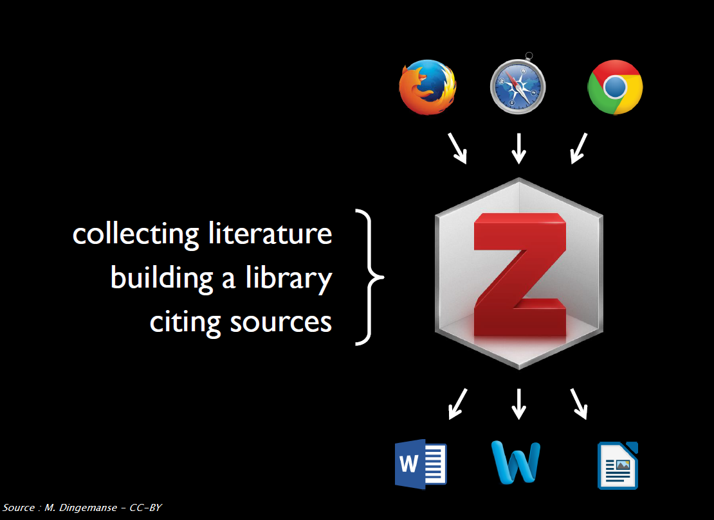

#### Note concernant Safari

Pourquoi Safari est-il barré ? Le connecteur Zotero pour Safari est beaucoup plus limité que celui pour Firefox, Chrome ou Edge. Par exemple, il ne prend pas en charge les fonctionnalités avancées telles que la **détection automatique de proxy** ou **l'importation automatique de RIS/BibTeX**.

![zotero][zotero] [Base de connaissance Zotero : Connecteur Zotero et Safari](https://docs.zotero-fr.org/kb/safari_compatibility/)

### Zotero est un logiciel libre

Pourquoi est-ce important?

* Les utilisateurs peuvent contribuer au logiciel - voir [la liste complète des extensions de Zotero](https://www.zotero.org/support/plugins), et participer à la communauté des utilisateurs par le biais du [Forum Zotero](https://forums.zotero.org/).
* Le développement est agile et orienté vers les utilisateurs.
* Zotero est développé par une organisation à but non lucratif, sans intérêt financier pour vos données ; vous n'êtes pas obligé de créer un compte pour utiliser Zotero.

Vous trouverez davantage de détails et des exemples concernant cette questions dans le billet du blog Zotero francophone : [Pourquoi Zotero?](https://zotero.hypotheses.org/1998).

## 2. Installer et configurer Zotero

🚧 **Si vous avez précédemment installé Zotero 6 et n'avez pas encore effectué la mise à jour vers Zotero 7, c'est le moment de le faire.**

Pour ce faire, dans le menu de Zotero cliquez sur *Aide* > *Vérifier les mises à jour..."*, puis suivez les indications qui s'affichent successivement.

### Installer Zotero

![zotero][zotero] [Site web Zotero : Télécharger Zotero](https://www.zotero.org/download/)

Vous devez installer à la fois l'**application** Zotero **ET** le **connecteur** Zotero adapté à votre navigateur internet (Chrome, Firefox ou Edge).

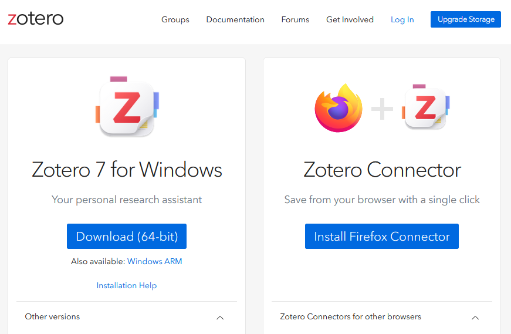

![zotero][zotero] [Documentation Zotero : Installation](https://docs.zotero-fr.org/installation/)

### Comment vérifier si l'installation a fonctionné ?

Pour profiter pleinement de Zotero, le logiciel doit être connecté à votre navigateur internet et à votre traitement de texte Microsoft Word ou LibreOffice Writer.

1. Vérifiez si Zotero est installé en ouvrant l'application sur votre ordinateur.
2. Ouvrez votre navigateur et vérifiez que l'icône Zotero apparaît dans la barre d'outils. Si elle n'apparaît pas, suivez les indications fournies dans la page dédiée de la documentation Zotero.
   
![zotero][zotero] [Pourquoi n'y a-t-il pas de bouton d'enregistrement dans la barre d'outils de mon navigateur ?](https://docs.zotero-fr.org/kb/no_toolbar_button/#pourquoi-ny-a-t-il-pas-de-bouton-denregistrement-dans-la-barre-doutils-de-mon-navigateur)

3. Ouvrez votre traitement de texte et vérifiez si l'extension Zotero est installée. En général, après l'installation de Zotero, un nouvel onglet apparaît dans votre traitement de texte. En fonction de votre logiciel, Zotero peut aussi être affiché avec d'autres "Compléments".

Si l'installation de l'extension de traitement de texte n'a pas fonctionné, vous pouvez la réinstaller à partir de Zotero lui-même.

1. Ouvrez Zotero.
2. Allez à *Edition* > *Paramètres* (ou *Zotero* > *Paramètres* sur Mac OS).
3. Cliquez sur l'onglet *Citer*.
4. Descendez à la rubrique _Traitements de texte_.
5. À ce stade, vous pouvez choisir d'installer ou de réinstaller un ou plusieurs extensions pour traitement de texte, en fonction des logiciels de traitement de texte installés sur votre ordinateur.

![zotero][zotero] [Documentation Zotero : Les extensions pour logiciel de traitement de texte](https://docs.zotero-fr.org/word_processor_integration)

![zotero][zotero] [Documentation Zotero : Préférences](https://docs.zotero-fr.org/preferences)

💬 _Dans Zotero 7 les "Préférences" sont désormais nommées "Paramètres". La documentation devrait prochainement être mise à jour pour prendre en compte ce changement._

### Configuration minimale des paramètres

Voici quelques recommandations pour démarrer. Tous les paramétrages sont accessibles depuis les _Paramètres_ de Zotero.

#### Section "Général"

Rubrique "Gestion des fichiers"

* Cochez la case "**Joindre automatiquement les fichiers PDF associés lors de l'enregistrement d'un document**", pour récupérer automatiquement les PDFs des articles lorsque vous êtes sur le site d'un éditeur ou tout autre site sur lequel le PDF est présent. Si vous êtes sur PubMed, Scopus ou une autre base de données bibliographiques, il faudra suivre le lien vers le site de l'éditeur pour enregistrer la référence bibliographique et le PDF de l'article en même temps. Et il faudra bien sûr, s'il s'agit d'une ressource payante, que votre institution soit abonnée.
* Cochez la case "**Récupérer automatiquement les métadonnées des PDF**".
* Décochez la case "**Faire une capture automatique de la page lors de la création de documents à partir de pages Web**", pour éviter d'encombrer votre bibliothèque avec des captures de toutes les pages Web à partir desquelles vous enregistrez des documents dans votre bibliothèque Zotero.

#### Section "Synchronisation"

Il n'est pas nécessaire de se créer un compte en ligne ni d'activer la synchronisation pour utiliser Zotero. C'est en revanche indispensable pour les deux fonctionnalités suivantes :

* la **synchronisation** de vos bibliothèques Zotero sur le serveur en ligne Zotero et entre plusieurs appareils (une ordinateur professionnel et un ordinateur personnel par exemple),
* les **groupes** pour créer des bibliothèques partagées.

Nous allons recourir à cette fonctionnalité de groupe en utilisant la bibliothèque de groupe créée pour le stage.

Pour faire apparaître cette bibliothèque de groupe dans Zotero, vous devez configurer la synchronisation Zotero.

Ces réglages sont accessibles depuis les _Paramètres_ > _Synchronisation_.

Pour démarrer, nous nous en tenons aux paramètres suivants, après la saisie de votre nom d'utilisateur et de votre mot de passe.

##### Synchronisation des données

Cochez _Synchroniser automatiquement_.

##### Synchronisation des fichiers

* Décochez _Synchroniser les fichiers joints de ma bibliothèque en utilisant..._, sauf si vous avez vous-même coché cette case antérieurement et paramétré le service à utiliser pour la synchronisation de vos fichiers joints.
* Cochez _Synchroniser les fichiers joints dans les bibliothèques en utilisant le stockage de Zotero_.

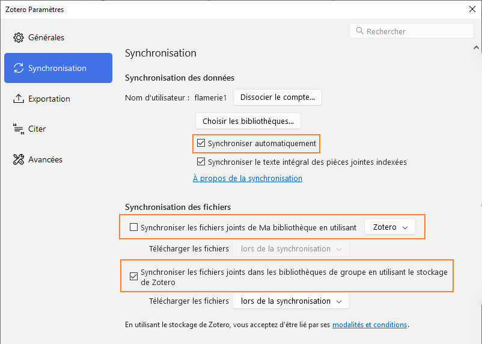

![zotero][zotero] [Documentation Zotero : Synchronisation](https://docs.zotero-fr.org/sync)

Une fois la synchronisation activée et une première synchronisation effectuée, vous devriez voir apparaître une nouvelle rubrique "Bibliothèques de groupe" dans le panneau de gauche de Zotero, en-dessous de "Ma bibliothèque".

Dans cette rubrique, devrait s'afficher la bibliothèque de groupe que vous venez de rejoindre ; vous devriez y trouver une collection (icône dossier) à votre nom d'utilisateur Zotero.

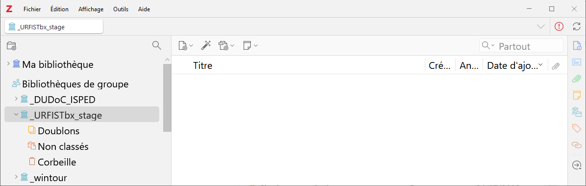


## 3. Constituer sa bibliothèque Zotero étape 1, ajouter des documents et des fichiers

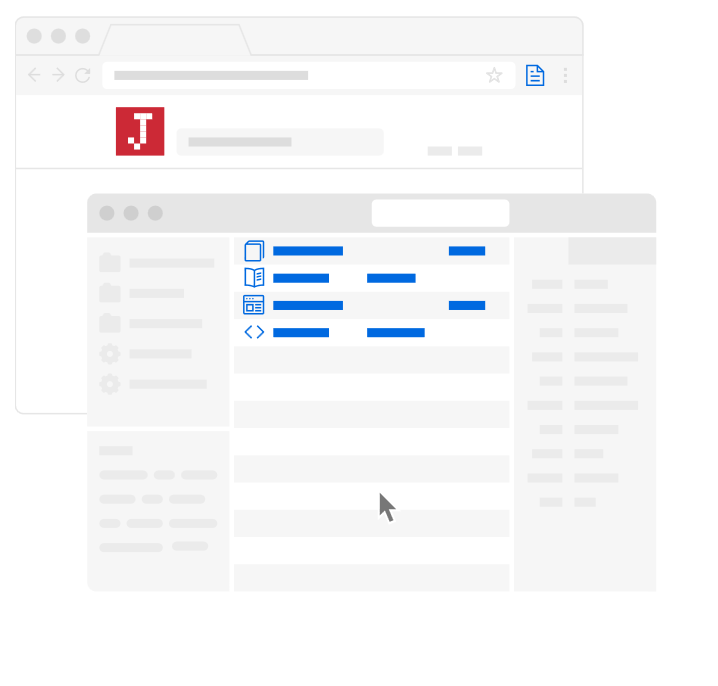

Une référence bibliographique, un **document** dans votre bibliothèque Zotero, est constituée de **métadonnées**, d'informations descriptives (titre, auteur, date, etc.) vous permettant de la retrouver facilement par la suite. Zotero structure les métadonnées que vous collectez sur les documents. Lorsque vous citez avec Zotero, ce dernier génère alors des citations et des bibliographies cohérentes. Zotero vous permet également de stocker des fichiers attachés aux références, sous forme de **pièces jointes**.

### Enregistrer des documents dans votre navigateur

C'est la méthode  :

* **la plus simple**,
* **la plus fiable**,
* **la plus recommandée**,

pour ajouter des documents dans votre bibliothèque.

Le connecteur Zotero est l'extension que vous avez installée dans votre navigateur. Cette extension détecte les références bibliographiques disponibles sur les pages web que vous visitez.

Ouvrez Zotero et cliquez sur le bouton _Save to Zotero_ de votre navigateur pour enregistrer la référence bibliographique en tant que document dans votre bibliothèque Zotero. Zotero essaie également d'enregistrer en même temps le fichier PDF en texte intégral en tant que pièce jointe.

Exemple : [un article de la revue "Natures Sciences Sociétés"](https://doi.org/10.1051/nss/2019025)

#### Exercice "Enregistrer des documents depuis les sites en ligne avec le connecteur Zotero"

📝 En naviguant sur les sites internet que vous utilisez habituellement pour vos recherches bibliographiques, enregistrez de nouveaux documents dans la collection à votre nom dans la bibliothèque de groupe du stage.

Vous pouvez enregistrer des livres, des articles de revue, des thèses, ou encore des pages web, des articles de presse ou de magazine, le tout est de tester l'enregistrement dans Zotero depuis vos sources habituelles. Ajoutez des fichiers (pdf, jpg ou autres) si applicable.


### Toutes les méthodes d'ajout

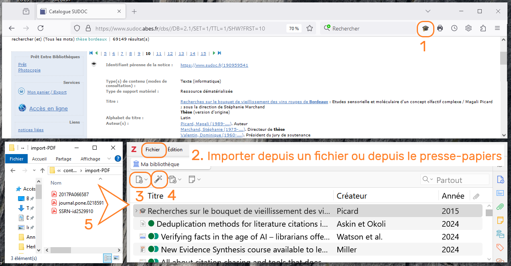

#### 1, le connecteur Zotero

C'est la méthode que nous venons d'utiliser.

#### 2, importer un fichier ou importer depuis le presse-papier

Certaines bases de données ou catalogues peuvent vous fournir un fichier téléchargeable contenant une ou plusieurs références. Les formats les plus courants pour ce type de fichier sont RIS (.ris) ou BibTeX (.bib). Cela est surtout utile pour les exportations à grande échelle ou lors d'un changement de logiciel de gestion bibliographique.

💡 **Sur certains sites, cet export est mieux configuré que l'enregistrement par le connecteur Zotero.**

#### 4, avec un identifiant unique

La baguette magique permet d'ajouter un document ou un lot de documents à partir de leur identifiant.

Les identifiants pris en charge sont les suivants :

* DOI,
* ISBN,
* identifiant PubMed, le PMID,
* identifiant arXiv Id,
* bibcode ADS.

Si vous disposez d'un fichier Excel comportant une colonne "ISBN" correctement renseignée, alors vous pouvez ajouter très facilement un lot d'ouvrages dans votre bibliothèque Zotero.

#### 5, depuis des PDF

Si vous avez déjà des PDF sur votre ordinateur, il peut être possible d'en récupérer les métadonnées _a posteriori_.

⚠️ **Cela n'est pas la méthode par défaut recommandée**. Cette fonctionnalité est utile pour traiter un lot de PDFs que vous avez en stock, mais elle ne doit pas constituer votre méthode habituelle pour ajouter du contenu à votre bibliothèque Zotero.

Pour ajouter un fichier PDF à Zotero, il suffit de le faire glisser depuis un dossier et de le déposer dans votre bibliothèque. Zotero recherche automatiquement les métadonnées et crée automatiquement un document attaché à ce fichier PDF lorsque cela est possible. Cependant, il est possible que le PDF que vous avez ajouté à votre bibliothèque Zotero ne soit pas reconnu par Zotero. Dans ce cas, aucune métadonnée n'est récupérée. Vous devez alors ajouter des métadonnées à l'aide d'un identifiant (DOI, ISBN,etc.) ou manuellement, en utilisant la fonction _Créer un document parent_.

Vous pouvez récupérer des métadonnées pour plusieurs PDF en même temps.

Exemple : un PDF envoyé par un collègue

![zotero][zotero] [Documentation Zotero : Récupérer les métadonnées des PDF](https://docs.zotero-fr.org/retrieve_pdf_metadata)

#### 3, manuellement

Parfois, il n'y a pas de métadonnées disponibles encodées dans la page web que vous visitez, ou le document que vous avez entre les mains n'est pas indexé dans un catalogue en ligne. Vous devez alors créer ou modifier la référence vous-même.

Dans Zotero, vous pouvez créer un nouveau document en cliquant sur le bouton _Nouveau document_ de la barre d'outils. Vous devez choisir **le type de document** pour lequel vous souhaitez créer un document (par exemple, "Présentation", "Rapport", etc.). Lorsque vous sélectionnez le type de document, un document vide apparaît. Vous pouvez alors remplir les champs en fonction du document que vous avez devant vous. Dans tous les cas, il est préférable d'être exhaustif et de donner le plus d'informations possible.

#### Exercice "Autres méthodes pour ajouter des documents"

📝 Ajoutez des documents en utilisant l'une des méthodes suivantes.

* **Baguette magique** : utilisez les DOI ci-dessous :

```
10.3389/FMARS.2017.00031
10.3389/fncir.2012.00077
10.3389/fnsys.2013.00014
10.3390/s17122757
10.3397/1.3702019
10.3724/SP.J.1118.2018.17252
10.3757/jser.49.Suppl-6_36
10.3758/BF03328608
10.3923/jeasci.2018.9380.9384
```

* **Saisie manuelle** : un rapport interne, une présentation ou tout autre document que vous ne trouvez pas en ligne.
* **A partir d'un PDF** : utilisez vos propres fichiers ou [les fichiers de ce dossier](https://github.com/fflamerie/zotero_gerer_biblio/blob/master/content/import-PDF).

### Vérifier et mettre à jour les documents que vous avez enregistrés

N'oubliez pas de vérifier et de modifier les documents que vous enregistrez dans votre bibliothèque, cela fait partie de l'ajout de contenu !

Zotero propose des fonctions intelligentes pour rendre cela plus facile et plus rapide que d'effectuer chaque modification entièrement manuellement. Par exemple :

* cliquez avec le bouton droit de la souris sur le contenu d'un champ `Créateur` pour inverser le nom et le prénom ou corriger la casse,
* cliquez avec le bouton droit de la souris sur le contenu d'un champ `Titre` pour transformer le texte avec toutes les _Initiales en Majuscules_ ou une _Lettre capitale en début de phrase_,
* etc.

Quelle que soit la méthode que vous utilisez pour ajouter des documents dans votre bibliothèque, il peut y avoir des coquilles à corriger ou des informations à ajouter.

#### Recommandation 1, choisir la bonne source

Privilégiez les sources fiables et exhaustives pour créer ou compléter vos documents, c'est-à-dire :

* **les sites d'éditeur et les bases de données bibliographiques** pour les articles de revue et les chapitres de livre (SpringerLink, Scopus, Cairn, etc. // évitez Google Scholar),
* **les catalogues de bibliothèques** pour les livres (Sudoc, WorldCat // évitez Amazon).

#### Recommandation 2, anticiper les normes

Renseignez-vous sur les exigences minimales en termes de rédaction bibliographique de votre domaine de recherche. Faut-il pour chaque livre enregistrer les date, lieu et éditeur commercial originaux? Si oui, recherchez-les et enregistrez-les en même temps que vous créez le document dans votre bibliothèque Zotero.

#### Recommandation 3, ne pas procrastiner

Procédez aux ajouts et modifications tout de suite! Tant que vous avez le document sous la main et/ou que vous avez l'information à portée de clic.

#### Ressources

![zotero][zotero] [Documentation Zotero : Ajouter des documents à Zotero](https://docs.zotero-fr.org/adding_items_to_zotero/)

![zotero][zotero] [Base de connaissance Zotero : Comment puis-je mettre en forme certains mots d'un titre: par ex. en italique, en exposant ou en indice ?](https://docs.zotero-fr.org/kb/rich_text_bibliography/)

![zotero][zotero] [Base de connaissance Zotero : Les types de documents et les champs associés dans Zotero > Champs citables non inclus dans Zotero](https://docs.zotero-fr.org/kb/item_types_and_fields/#champs-citables-non-inclus-dans-zotero)

## 4. Constituer sa bibliothèque Zotero étape 2, organiser le contenu, des références bibliographiques aux annotations de PDF

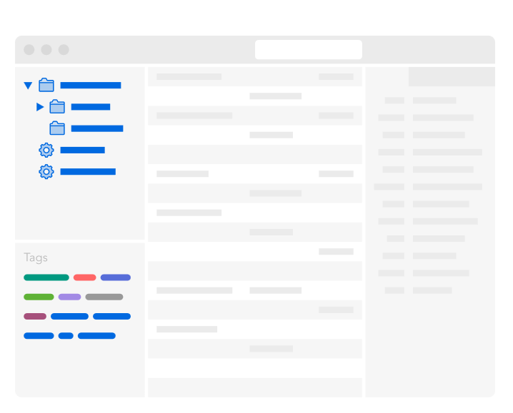

Indépendamment du logiciel utilisé et de la volumétrie à considérer, voici les principales caractéristiques souhaitables pour une bibliothèque personnelle.

* Elle offre de nombreux moyens de recherche et de navigation.
* Elle comporte des informations bibliographiques de référence, complètes et exactes.
* Elle facilite l'étude et la prise de notes.

### Les principaux outils pour organiser sa bibliothèque

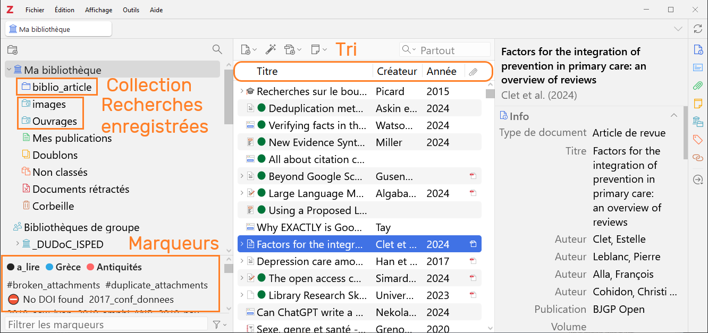

Nous nous concentrons sur les fonctionnalités les plus utiles quand on commence  une bibliothèque, c'est-à-dire :

* les marqueurs,
* les recherches -> rapide vs. avancée, immédiate vs. sauvegardée avec mise à jour dynamique,
* les notes.

⚠️ Dans Zotero, l'icône associée à une **collection** est un dossier, mais les collections ressemblent davantage à des **listes de lecture musicales** (pensez à iTunes, Spotify, etc.) qu'à des dossiers dans le système de fichiers de votre ordinateur.

### Démarrer avec l'organisation de sa bibliothèque

#### Indexer avec les marqueurs

* Créez un marqueur **a_lire**.
* Associez-lui une couleur.
* Ajoutez ce marqueur à tous les documents de votre bibliothèque d'un seul coup : comment faire ? 2 méthodes sont possibles.
* Combien de marqueurs de couleur pouvez-vous créer ?

#### Recherche rapide et recherche avancée

* Recherche rapide : quelle différence faites-vous entre une recherche dans `Champs & Marqueurs` et une recherche dans `Partout` ?
* Créez une recherche sauvegardée pour récupérer tous les articles marqués **a_lire** ET ajoutés dans votre bibliothèque au cours des 7 derniers jours.


### Conserver ou non les marqueurs enregistrés automatiquement?

Par défaut, Zotero enregistre automatiquement les mots-clés associés au document dans la base à partir de laquelle vous l'avez enregistré : indexation Rameau dans le Sudoc, mots-clés auteur dans les sites d'éditeur et les bases de données bibliographiques, indexation contrôlée dans les bases de données bibliographiques. Tous ces termes hétérogènes accumulés peuvent finir par produire une liste de termes redondants (synonymes, variantes diverses d'un même mot) difficile à exploiter, et qui vient parasiter votre liste de marqueurs personnels.

Vous pouvez désactiver cet enregistrement depuis les _Paramètres_ > _Général_ > _Divers_ > _Ajouter automatiquement aux documents des marqueurs à partir des mots-clés fournis_.

Notez toutefois que même en décochant cette case vous enregistrerez toujours les mots-clés associés lorsque vous ajoutez des documents via un **import de fichier** et non via le navigateur. Décocher cette case ne désactive pas l'import du champ _keywords_ (ou équivalent) présent dans un fichier bibliographique. Il y a donc de fortes chances que vous retrouviez tout de même des marqueurs ajoutés automatiquement dans votre bibliothèque. Par ailleurs, il est parfois utile de se référer aux mots-clés auteurs ou aux indexations contrôlées d'une base de données.

Pour conserver une liste de marqueurs personnels propre, facile à exploiter et bien distincte des marqueurs ajoutés automatiquement, la meilleure option est par conséquent de **préfixer** ses marqueurs personnels au moyen d'un signe typographique tel que le tiret bas `_`. Vos marqueurs personnels seront ainsi non seulement facilement identifiables, mais toujours présentés en premier dans le sélecteur de marqueurs.

### Pourquoi privilégier les marqueurs plutôt que les collections?

On peut avancer 3 raisons principales.

* **Lisibilité** : grâce aux **marqueurs colorés** vous visualisez rapidement tous les documents associés à un marqueur. Vous pouvez de plus facilement **filtrer** vos marqueurs dans le sélecteur de marqueurs. Cela autorise à en créer beaucoup sans risque de confusion.
* **Portabilité** : les marqueurs font partie des informations bibliographiques du document et sont ainsi, par exemple, exportés au même titre que toutes les autres informations bibliographiques lorsque vous exportez des documents dans un fichier au format .ris, . csv, etc. Les collections et les recherches enregistrées relèvent en revanche de **l'interface** de votre bibliothèque, l'information du classement dans une collection n'est pas enregistrée en tant qu'information bibliographique du document.
* **Gestion automatisée** : grâce aux scripts de [l'extension Actions & Tags](https://github.com/windingwind/zotero-actions-tags), on peut facilement gérer une quantité importante de marqueurs, les scinder, les supprimer de façon globale ou sélective, etc. [L'extension Zutilo](https://github.com/wshanks/Zutilo/blob/master/i18n/fr/readme/docs/COMMANDS.md) permet quant à elle de copier tous les marqueurs associés à une référence et de les coller vers une ou plusieurs références.

![zotero][zotero] [KBFR Zotero : Les extensions de Zotero](https://docs.zotero-fr.org/kbfr/kbfr_extensions)

### Les recherches sauvegardées pour automatiser l'organisation

💡 **Laissez Zotero travailler pour vous**

N'oubliez pas que le classement dans les collections, l'ajout de marqueurs, etc. nécessitent une saisie manuelle et prennent du temps. **Les recherches sauvegardées** sont un excellent moyen de gagner du temps et de l'efficacité, en utilisant automatiquement les informations que vous avez récupérées et celles que vous avez ajoutées pour chaque document.

Les recherches sauvegardées prennent en charge une syntaxe relativement riche.
Pour retrouver toutes les références pour lesquelles un champ est vide, par exemple les références sans résumé, il suffit de créer une recherche sur le modèle suivant :

```
Résumé -- Ne contient pas -- %
```

### Ressources

![zotero][zotero] [Documentation Zotero : Détection des doublons](https://docs.zotero-fr.org/duplicate_detection)

![zotero][zotero] [Documentation Zotero : Collections et marqueurs](https://docs.zotero-fr.org/collections_and_tags)

![zotero][zotero] [Documentation Zotero : Rechercher](https://docs.zotero-fr.org/searching)

![zotero][zotero] [Documentation Zotero : Tri](https://docs.zotero-fr.org/sorting)

![zotero][zotero] [Documentation Zotero : Notes](https://docs.zotero-fr.org/notes)

![zotero][zotero] [Documentation Zotero : Documents connexes](https://docs.zotero-fr.org/related)

Billet du blog Zotero francophone : [Optimiser l’organisation de sa bibliothèque](https://zotero.hypotheses.org/3298)

Exemples d'organisations de bibliothèque Zotero par des utilisateurs : [ressources associées au billet "Comment organiser sa bibliothèque?" dans la bibliothèque de groupe zfrancophone](zotero://select/groups/2233096/collections/SZEXH6L3)

### Le lecteur de fichiers intégré à Zotero et ses outils d'annotation

👉 Voir le support du stage [Zotero pour les revues de littérature > Annoter ses PDF avec Zotero](https://github.com/fflamerie/zotero_revlit/blob/main/docs/zotero_RevLit_COURS.md#annoter-ses-pdf-avec-zotero)


## 5. Identifier et installer dans Zotero les styles bibliographiques de référence de son domaine

### Les types de style bibliographique

Un style bibliographique définit la façon dont les éléments bibliographiques d’un document sont organisés et mis en forme. C’est ainsi le style qui prescrit quelles informations bibliographiques sont affichées, dans quel ordre et selon quelle mise en forme (gras, italique, guillemets, ponctuation, retraits et espacements, etc.).

On considère 2 éléments.

* Les **citations** : elles peuvent être insérées soit sous la forme d’**appels de citation** (numéro, nom de l’auteur et date, etc.) **dans le texte**, soit sous la forme de références plus ou moins abrégées en **notes** de bas de page ou de fin.
* La **bibliographie** ou **liste des références citées**.

On distingue différents types de style bibliographiques, correspondant à des formats de style Zotero différents. On trouve ainsi dans [le dépôt des styles Zotero](https://www.zotero.org/styles), plus de 10'000 styles regroupés en 2 grands ensembles :

*   les styles _**in-text**_, dans lesquels un appel de citation dans le texte renvoie à une entrée de la bibliographie,
*   les styles _**note**_, dans lesquels un marqueur (symbole, nombre, etc.) pointe vers une note de bas de page ou de fin.

#### Les styles _in-text_ numériques
Les styles numériques sont les plus simples et les plus univoques. Dans le texte, chaque référence citée est appelée par un **numéro**. Une même référence conserve le même numéro tout au long du texte.

>Yeast cells were grown at 25°C in batch cultures on 0.5% methanol for 36 hours <span style="color:#0000CD;">[21, 22]</span>.

Dans la bibliographie, les références sont classées par **ordre d’apparition dans le texte**.

><span style="color:#0000CD;">21\.</span> Zwart KB, Veenhuis M, Harder W (1983) Significance of yeast peroxisomes in the metabolism of choline and ethanolamine. Antonie Van Leeuwenhoek 49: 369-385.
>
><span style="color:#0000CD;">22\.</span> van der Klei IJ, Harder W, Veenhuis M (1991) Methanol metabolism in a peroxisome-deficient mutant of Hansenula polymorpha: a physiological study. Arch Microbiol 156: 15-23.

##### Les styles _in-text_ numériques composites
Dans les styles numériques composites, une entrée bibliographique peut contenir plusieurs références.
Ce type de style n'est **pas pris en charge par CSL**, le langage informatique dans lequel sont encodés les styles bibliographiques utilisés par Zotero.

Dans le texte :

>Yeast cells were grown at 25°C in batch cultures on 0.5% methanol for 36 hours <span style="color:#0000CD;">(1)</span>

Dans la bibliographie :

><span style="color:#0000CD;">1\. a)</span> Zwart KB, et al. (1983) Antonie van Leeuwenhoek 49: 369-385, <span style="color:#0000CD;">b)</span> van der Klei IJ, et al. (1991) Arch Microbiol 156: 15-23.

#### Les styles _in-text_ auteur-date

Les styles auteur-date sont un peu plus complexes que les styles numériques, car l’appel de citation est composé du nom d’un ou de plusieurs des auteurs et de la date. Ces styles intègrent ainsi des règles de **désambiguïsation**, c’est-à-dire des règles prescrivant l’ajout d’informations pour distinguer des appels de citation qui pourraient être identiques mais qui font référence à des documents différents. Pour distinguer deux articles parus la même année avec le même nom de premier auteur, on ajoute par exemple un suffixe à chacun des appels de citation : (Smith 2017a ; Smith 2017b).

Dans le texte, chaque référence citée est appelée par **le nom de l'auteur et la date de publication**.

> Yeast cells were grown at 25°C in batch cultures on 0.5% methanol for 36 hours <span style="color:#0000CD;">(van der Klei et al. 1991; Zwart et al. 1983)</span>
>
>Yeast cells were grown at 25°C in batch cultures on 0.5% methanol for 36 hours <span style="color:#0000CD;">(van der Klei et al.; Zwart et al.)</span></cite>

Dans la bibliographie, les références sont classées par **ordre alphabétique d'auteur**.

>van der Klei IJ, Harder W, Veenhuis M (1991) Methanol metabolism in a peroxisome-deficient mutant of Hansenula polymorpha: a physiological study. Arch Microbiol 156: 15-23.
>
>Zwart KB, Veenhuis M, Harder W (1983) Significance of yeast peroxisomes in the metabolism of choline and ethanolamine. Antonie Van Leeuwenhoek 49: 369-385.

#### Les styles _in-text_ label
Dans le texte, chaque référence citée est appelée par un **code**.

>Yeast cells were grown at 25°C in batch cultures on 0.5% methanol for 36 hours <span style="color:#0000CD;">[ZwVH1983; vaHV1991]</span>.</cite>

Dans la bibliographie, les références sont classées par **ordre d’apparition dans le texte**.

><span style="color:#0000CD;">[ZwVH1983]</span> Zwart KB, Veenhuis M, Harder W (1983) Significance of yeast peroxisomes in the metabolism of choline and ethanolamine. Antonie Van Leeuwenhoek 49: 369-385.
>
><span style="color:#0000CD;">[vaHV1991]</span> van der Klei IJ, Harder W, Veenhuis M (1991) Methanol metabolism in a peroxisome-deficient mutant of Hansenula polymorpha: a physiological study. Arch Microbiol 156: 15-23.

Un seul style correspond à ce modèle dans le dépôt des styles, le style [DIN 1505-2 (alphanumeric, German)](https://www.zotero.org/styles/din-1505-2-alphanumeric).
Il présente 2 limites :

* il est monolingue en allemand,
* le schéma de construction du label ne peut pas être modifié.

Un label personnalisé peut être défini, mais cela devra être fait manuellement pour chaque référence.

* Pour chaque référence le label à utiliser devra être indiqué dans le champ _Extra_ de la notice Zotero, sous la forme : `citation-label: valeur_du_label`.
* Par conséquent, il faudra **désambiguïser** manuellement des labels qui seraient identiques mais se rapporteraient à des articles différents (même premier auteur et même année).

#### Les styles _note_
Les styles avec notes, utilisés plutôt dans les domaines des lettres et arts et des sciences humaines, sont les plus complexes. Les citations ne sont pas des codes insérés dans le texte, mais des références rédigées de façon plus ou moins abrégée, insérées en tant que note de bas de page ou de fin de document. Il est de plus parfois fait usage de mentions latines tels que _ibidem_, _op. cit._, etc., selon des règles de substitution précises.

On trouve ainsi dans le texte un appel de note, et en bas de page ou en fin de document le contenu de la note.

>"In the Island of St. Kilda, according to Martin, <span style="color:#0000CD;">[*]</span> the men do not acquire beards until the age of thirty or upwards, and even then the beards are very thin. “
>
><span style="color:#0000CD;">[*]</span>'Voyage to St. Kilda' (3rd edit. 1753), p. 37.

Dans la bibliographie, les références sont en général classées par **ordre alphabétique d’auteur**. Notez que certains styles avec notes ne prévoient pas de liste récapitulative des références citées.

Le format du marqueur doit être paramétré dans le **traitement de texte**.

**Exemple dans LibreOffice**

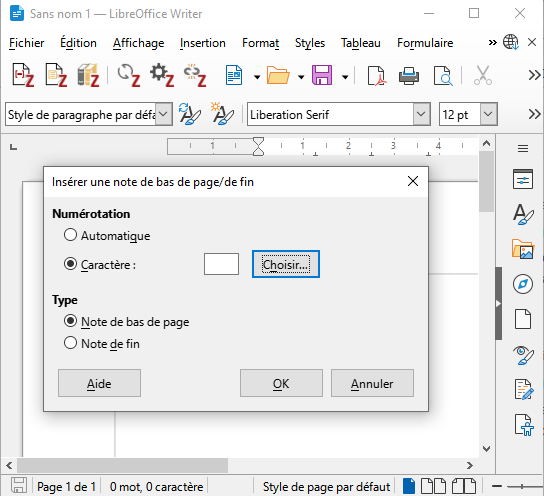

### Comment choisir un style bibliographique quand aucun n'est imposé?

Les critères de choix suivants peuvent être pris en compte.

#### Critère de choix 1, existence d'un modèle de référence
Existe-t-il un style de référence ou fréquemment utilisé dans votre domaine? Par exemple "Vancouver" et "American Psychological Association" pour les sciences de la santé, "Modern Language Association" pour certains domaines de la littérature, "IEEE" pour les sciences de l'ingénieur, etc.

Vous utilisez le style de l'ED droit de Bordeaux? Consultez la [Documentation du style CSL “Université de Bordeaux - École doctorale de droit (French)” pour Zotero](https://documentation-style-csl-ed-droit-ubx.readthedocs.io/en/latest/) : le site intègre toutes les spécificités de saisie et des exemples pour tous les types de document.


#### Critère de choix 2, typologie documentaire prise en charge

Citez-vous de nombreux types de documents différents? Tous les styles ne prennent pas en charge tous les types de documents. Le style _Nature_, par exemple, ne sera pas le plus adapté si vous citez des documents non publiés comme les thèses. La revue _Nature_ demande aux auteurs de citer un nombre restreint de types de document (voir les [instructions aux auteurs](http://www.nature.com/nature/for-authors/formatting-guide), rubrique _References_), aussi le style CSL pour Zotero _Nature_ encode-t-il la mise en forme des citations uniquement pour ces types de document.

#### Critère de choix 3, langue de rédaction

Rédigez-vous seulement en français ? Seulement dans une autre langue ? Dans différentes langues selon les cas ? Si certains styles sont agnostiques du point de vue de la langue, d'autres ont au contraire une langue prédéfinie qui ne peut pas être modifiée. Ainsi le style _Nature_ est-il paramétré uniquement pour la langue anglaise, selon la norme britannique.

Tous les styles localisés pour une langue autre que l’anglais comporte le nom de cette langue dans leur intitulé. Ainsi, rechercher « français » dans le dépôt des styles Zotero affiche uniquement les styles localisés pour la langue française, « deutsch » uniquement les styles loclaisés pour la langue allemande, etc. Les styles sans mention de langue sont soit localisés en anglais, soit agnostiques du point de vue de la langue.

Limiter l’utilisation d’un style à une langue déterminée permet d’éviter les erreurs de la part des utilisateurs : quelle que soit la langue par défaut de l’utilisateur, ce dernier ne pourra pas rédiger les éléments bibliographiques dans une autre langue que celle prévue par le style bibliographique. Une revue publiant des articles dans une unique langue se prémunira ainsi des erreurs de langue en localisant son style bibliographique. Par ailleurs, cela permet de définir précisément et rigoureusement la ponctuation et de s’assurer du respect scrupuleux des règles de typographie, prescrivant par exemple d’insérer une espace insécable avant le point-virgule en français.

#### Comparer facilement des styles dans Zotero

Deux outils facilitent la comparaison des styles bibliographiques dans Zotero.

* La **fonctionnalité _Aperçu des styles_** est accessible depuis les _Paramètres_ > _Citer_.

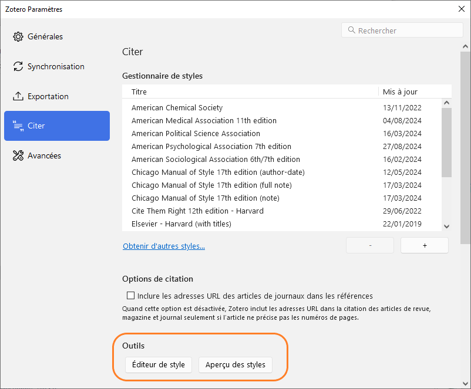
  
* Une entrée bibliographique du document en cours de sélection dans la bibliothèque peut être affichée en **en-tête du panneau de droite**.


Dans l’aperçu des styles, Zotero génère les citations et la bibliographie correspondante **dans différents styles**, à partir d’une **sélection de références**. Si on peut ainsi comparer d'un seul coup les paramétrages de plusieurs styles pour des types de documents différents, plusieurs clics sont nécessaires pour générer l'aperçu, dont la lecture peut être difficile si vous avez installé un grand nombre de styles.

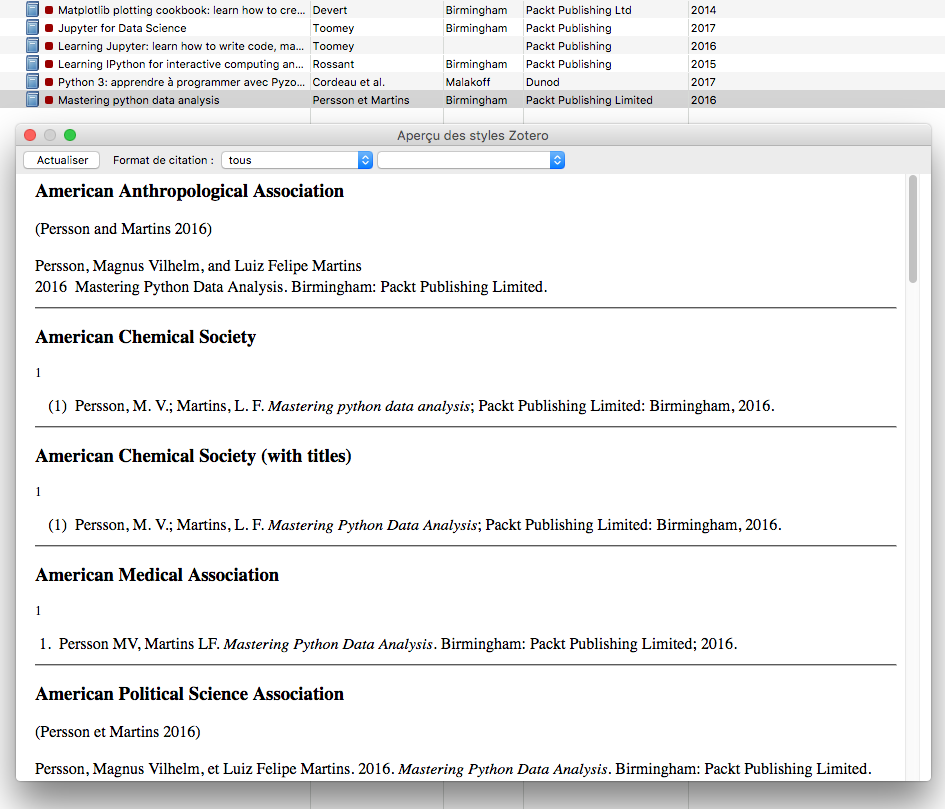

L'en-tête du panneau de droite permet de visualiser rapidement la mise en forme effectuée **par un style déterminé**, **sur une référence précise**. Il permet également de s'assurer au fur et à mesure de la saisie correcte des informations bibliographiques, car il rend visibles immédiatement les erreurs de saisie ayant un impact sur les références rédigées. L'en-tête affiche toutefois uniquement l'entrée de bibliographie et non la **citation**, or il peut s'agit d'un élément important à prendre en compte dans la comparaison de styles, notamment pour les styles de type note.

##### Points de vigilance

Quel que soit l'outil et la méthode utilisés pour comparer des styles, il importe de s'assurer de deux points afin que la comparaison soit significative.

Tout d'abord, assurez-vous que les documents que vous utilisez comme exemples reflètent la **diversité de types de documents** que vous allez citer (article, chapitre, mais aussi thèse ou encore brevet ou film ) : vous vérifierez ainsi que tous ces types sont bien pris en compte par les styles que vous comparez.

Ensuite, et surtout, assurez-vous que ces documents sont complets et exacts dans votre bibliothèque Zotero.

*  **S'il manque des informations bibliographiques**, il est logique que le style ne puisse pas les afficher quand il génère les citations et la bibliographie.
*  **Si vous faites un usage inadéquat ou détourné de certains champs**, vous générerez également une bibliographie détournée ou inadéquate, ne correspondant pas au résultat que produit le style normalement.

#### Comparatif de styles bibliographiques en SHS

Les bibliothèques universitaires de Nanterre proposent un tableau comparatif synthétique des styles suivants :

* APA 7ème édition (auteur-date),
* Petit Chicago (auteur-date),
* Tapuscrit (auteur-date),
* Presses universitaires de Rennes (note),
* Tapuscrit (note),
* Triangle (note),
* Université de Liège - Droit (note),
* Université de Bordeaux - Ecole doctorale de droit (note).

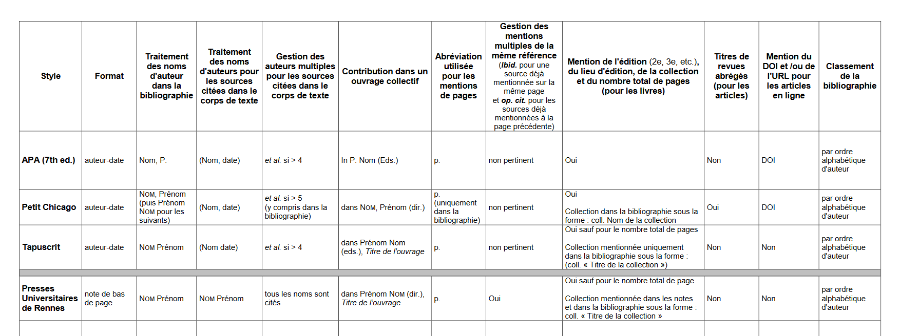

Voir : Willemin, E. (2022, avril 5). Quel style Zotero choisir pour son mémoire / sa thèse ? Université Paris Nanterre - Bibliothèques universitaires. http://bu.parisnanterre.fr/sautoformer/quel-style-zotero-choisir-pour-son-memoire-sa-these

### Ressources

![zotero][zotero] [Documentation Zotero : Les styles bibliographiques](https://docs.zotero-fr.org/styles)

![zotero][zotero] [Documentation Zotero : Préférences : Citer](https://docs.zotero-fr.org/cite/)

Modifier un style bibliographique : support de formation Urfist Bordeaux : [Créer des styles bibliographiques CSL](https://github.com/fflamerie/zotero_csl)

Modifier un style bibliographique : billet du blog Zotero francophone : [Apporter de petites modifications à un style bibliographique](https://zotero.hypotheses.org/3746)

## 6. Citer avec Zotero

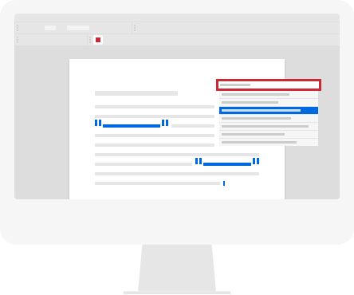

Bien sûr, vous pouvez appliquer les règles de citation à la main, mais Zotero sera plus rapide et plus cohérent. Voici ce que Zotero fera notamment :

* compter les auteurs et afficher _et al._ si nécessaire ;
* calculer, générer et mettre à jour des citations textuelles précises, qu'elles soient numériques ou sur le modèle auteur-date ;
* inclure toutes les références que vous avez citées dans votre texte (et seulement celles-là) dans la bibliographie ;
* trier cette bibliographie en fonction des exigences du style de citation ;
* gérer et corriger la ponctuation, les majuscules, les indentations ;
* _et bien plus encore..._

Il vous évite d'effectuer ces tâches répétitives pour vous permettre de vous concentrer sur les aspects de la citation qu'il ne prend pas en charge :

* la sélection des documents à citer,
* la complétude et l'exactitude des informations bibliographiques à indiquer.

Zotero fait également ce qui suit.

* Insérer dans n'importe quel document (courriel, fichier .pptx, etc.) des références bibliographiques correctement mises en forme par un simple glisser-déposer : c'est la **Copie rapide**.
* Créer des bibliographies indépendantes dans différents formats (.html, .rtf) :  c'est le menu contextuel _Créer une bibliographie à partir des documents sélectionnés..._
* Créer des bibliographies dynamiques collaboratives en ligne, grâce à des bibliothèques partagées privées ou publiques : c'est l'une des fonctionnalités des **groupes** Zotero.

### Exercice "Citer avec Zotero"

📝 L'objectif est de reproduire exactement le résultat présenté dans le fichier de modèle disponible au format PDF dans [la rubrique Exercice "Citer avec Zotero" du support de formation](https://github.com/fflamerie/zotero_gerer_biblio/blob/master/README.md#exercice-citer-avec-zotero).

Le style bibliographique utilisé est un style auteur-date, le style **ISO-690 (author-date, no abstract, Français)**.

### Ressources

![zotero][zotero] [Documentation Zotero : Créer des bibliographies](https://docs.zotero-fr.org/creating_bibliographies)

![zotero][zotero] [Documentation Zotero : Les extensions pour logiciel de traitement de texte](https://docs.zotero-fr.org/word_processor_integration)

Si vous utilisez d'autres logiciels que Word ou LibreOffice :

* Billet du blog Zotero francophone : [Zotero et LaTeX](https://zotero.hypotheses.org/762)
* Billet du blog Zotero francophone : [Markdown et Zotero](https://zotero.hypotheses.org/2258)

## 7. De la bibliothèque Zotero à la bibliographie en ligne

### Les groupes Zotero

Les **groupes Zotero** constituent un moyen simple de partager de la bibliographie, qu’il s’agisse de travailler de façon collaborative et privée avec d’autres personnes et/ou de diffuser des sélections bibliographiques auprès d’un public plus ou moins large.

Vous pouvez choisir de rendre publique votre bibliothèque Zotero personnelle, ce qui aura pour effet de permettre à tout internaute de consulter vos références bibliographiques. Ce paramétrage n’affecte pas les **fichiers joints**, qui demeurent accessibles de vous seul.

Le groupe Zotero constitue toutefois une bien meilleure option si vous souhaitez partager de la bibliographie.

En premier lieu, le groupe Zotero consiste en un **espace à part** distinct de votre bibliothèque personnelle : lorsque vous ajoutez un document depuis votre bibliothèque personnelle dans une bibliothèque de groupe, il est copié de votre bibliothèque vers cette bibliothèque de groupe. Si vous modifiez ce même document dans votre bibliothèque personnelle, les modifications ne sont pas répercutées dans la bibliothèque de groupe, et inversement. Vous distinguez ainsi nettement votre travail bibliographique personnel du travail bibliographique partagé. Il est bien sûr possible d’enregistrer un document directement dans la bibliothèque de groupe, sans effectuer de détour par votre bibliothèque personnelle.

Le groupe Zotero permet ensuite de définir très précisément qui a le droit de consulter ou modifier la bibliothèque de groupe, grâce à la combinaison des paramétrages suivants.

* Le **type de groupe** : privé, public à participation restreinte ou public à participation ouverte
* Les **membres du groupe** : rôle de membre, d’administrateur ou de propriétaire
* Les **droits accordés sur la bibliothèque** : lecture de la bibliothèque, modification des documents de la bibliothèque, modification des fichiers

### Points d'attention concernant la synchronisation et les groupes

* Le **quota de 300 Mo** d’espace de stockage gratuit sur le serveur Zotero concerne les **fichiers joints** et non les références bibliographiques : si vous ne synchronisez pas vos fichiers joints vous n’aurez aucun problème de dépassement de votre espace de stockage. Pour les bibliothèques de groupe, l'espace de stockage est décompté sur le quota du **propriétaire du groupe**.
* Le compte en ligne vous permet d’**enregistrer des documents directement dans votre bibliothèque en ligne**. Vous pouvez ainsi ajouter des documents dans votre bibliothèque Zotero même si Zotero n’est pas installé sur l’ordinateur que vous utilisez. Il faut en revanche que le connecteur Zotero du navigateur internet soit installé, ou que vous utilisiez l'ajout par identifiant.
* Vous retrouvez dans votre bibliothèque en ligne une partie des fonctionnalités de votre bibliothèque locale, à l’exception notamment des recherches enregistrées et des options de menu contextuel de modifications automatiques des champs (« Transformer le texte » pour les titre, « Inverser nom/prénom », etc.). A noter que l'application locale est indispensable pour l'interaction avec **les extensions de traitement de texte**.
* Si le droit de consulter la bibliothèque de groupe peut être accordé à tout internaute, **cette consultation est limitée aux références bibliographiques** : les fichiers joints demeurent toujours seulement accessibles aux membres du groupe.
* Veillez à **la bonne attribution des droits** en fonction de l’organisation souhaitée. Par exemple, si les droits des membres du groupe sont limités à la seule consultation de la bibliothèque, n’oubliez pas d’attribuer le rôle d’administrateur à toutes les personnes qui doivent ajouter des documents dans la bibliothèque ou les modifier.
* Un groupe Zotero n’implique pas forcément plusieurs contributeurs. Vous pouvez être le seul contributeur d’un groupe dont la bibliothèque peut être consultée par tous, ou encore vous pouvez créer un groupe simplement pour disposer d’une bibliothèque distincte de votre bibliothèque personnelle.
* Un **flux RSS** affiché sur la page de la bibliothèque en ligne du groupe permet de suivre les ajouts dans la bibliothèque. Il faut pour cela que le groupe soit public, et sa bibliothèque consultable par tous.

### Ressources

![zotero][zotero] [Documentation Zotero : Les groupes Zotero](https://docs.zotero-fr.org/groups)

![zotero][zotero] [Documentation Zotero : Synchronisation](https://docs.zotero-fr.org/sync)

![zotero][zotero] [Documentation Zotero : Est-ce que la bibliothèque en ligne est identique à l’application de bureau Zotero ?](https://docs.zotero-fr.org/kb/web_vs_desktop/)

Billets du blog Zotero francophone

* [Bibliothèque de groupe : quelques pistes pour collaborer efficacement](https://zotero.hypotheses.org/1311)
* [Travailler avec plusieurs bibliothèques Zotero](https://zotero.hypotheses.org/1764)
* [Produire des bibliographies réutilisables avec Zotero](https://zotero.hypotheses.org/3503)
* [Produire des bibliographies commentées et annotées avec Zotero](https://zotero.hypotheses.org/3556)

## 8. Où vont vos données Zotero?

![zotero][zotero] [Documentation Zotero : Le répertoire de données Zotero](https://docs.zotero-fr.org/zotero_data)

⚠️ 2 points de vigilance sont à souligner.

* Assurez-vous que le répertoire de données Zotero fait bien partie des données que vous **sauvegardez** automatiquement et régulièrement.
* Assurez-vous que votre répertoire de données n'est pas localisé à un emplacement identifié comme **risqué**.

![zotero][zotero] [Documentation Zotero : Paramètres avancés > Emplacements risqués pour votre répertoire de données](https://docs.zotero-fr.org/advanced/#emplacements-risques-pour-votre-repertoire-de-donnees)

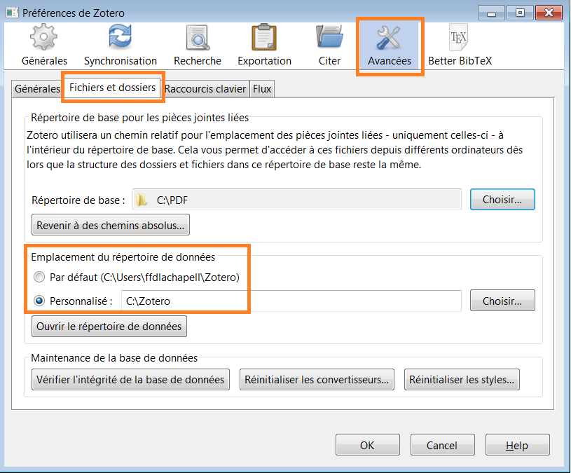

## 9. Conclusion

### Des questions?

* Lisez la **documentation**! Certaines pages sont disponibles uniquement en anglais, mais la documentation est exhaustive et détaillée. Nous vous recommandons comme point de départ [la page d'accueil de la version francophone de la documentation](https://docs.zotero-fr.org).
* Vous rencontrez une difficulté? Vous n'êtes probablement pas le premier ni le seul, consultez le **forum** et créez si besoin une nouvelle discussion : [Forum Zotero](https://forums.zotero.org/)


![zotero][zotero] [Documentation Zotero : Obtenir de l'aide](https://docs.zotero-fr.org/getting_help)

[zotero]: img/icone_zotero.png


### Aller plus loin

Nous avons parcouru les principale fonctionnalités de Zotero, mais Zotero peut faire bien plus encore pour devenir votre assistant de recherche personnel.

Vous trouverez un premier ensemble de trucs et astuces pour optimiser et augmenter votre usage de Zotero dans les billets du [blog Zotero francophone](https://zotero.hypotheses.org/).

![zotero][zotero] Dans la documentation Zotero, la rubrique [Tirer le meilleur parti de Zotero](https://docs.zotero-fr.org/locate/) constitue un bon point de départ pour explorer toutes les potentialités du logiciel.

#### Configurer l'option "Recherche dans la bibliothèque"

Dans cette rubrique "Tirer le meilleur parti de Zotero", le paramétrage du résolveur de liens de votre institution est un exemple de réglage complémentaire simple à effectuer, source de gain de temps et d'efficacité pour localiser le texte intégral d'une ressource et y accéder.

Dans la section _Paramètres_>_Général_, rubrique _Localiser_, ouvrez le menu déroulant _Résolveur de liens_ et naviguez dans la liste géographique pour sélectionner votre établissement.

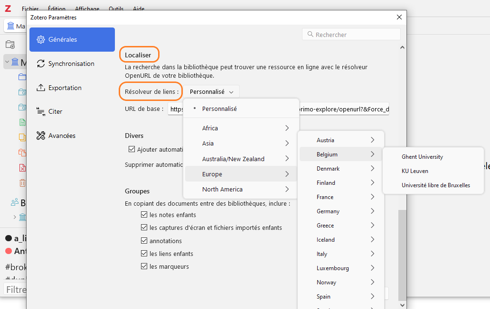

Cela vous permettra de générer, dans le système documentaire de votre établissement, la page correspondant au document sélectionné dans votre bibliothèque Zotero. Cette page affiche toutes les options d'accès disponibles dans votre établissement, y compris si le document est disponible au format imprimé et non au format électronique. Certains établissements optent pour un paramétrage sans affichage d'une page intermédiaire, et vous êtes alors automatiquement redirigé vers le texte intégral.

L'option _Recherche dans la bibliothèque_ est accessible depuis le menu _Localiser_, c'est-à-dire la flèche entourée d'un cercle en bas de la barre de raccourcis du panneau de droite.

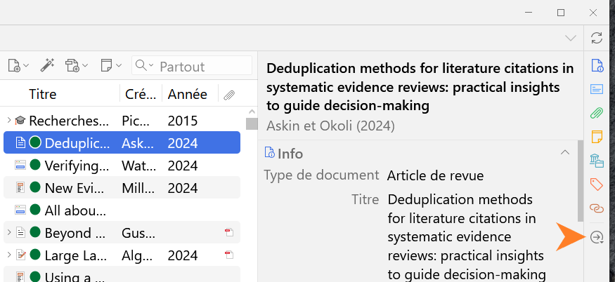

![zotero][zotero] [Documentation Zotero : Le menu Localiser](https://docs.zotero-fr.org/locate)

![zotero][zotero] [KBFR Zotero : Trouver des fichiers PDF de texte intégral avec Zotero](https://docs.zotero-fr.org/kbfr/kbfr_texte_integral)

#### Zotero sans Zotero, ZoteroBib

Billet du blog Zotero francophone : [Lancement de ZoteroBib : créez vos bibliographies en un clin d’oeil](https://zotero.hypotheses.org/1795)

# Crédits

<a rel="license" href="http://creativecommons.org/licenses/by-sa/3.0/fr/"></a><br />Ce document est mis à disposition selon les termes de la <a rel="license" href="http://creativecommons.org/licenses/by-sa/3.0/fr/">Licence Creative Commons Attribution -  Partage dans les Mêmes Conditions 3.0 France</a>.

**Auteur**

Frédérique Flamerie

**Visuels**

Site [Zotero](https://www.zotero.org/)
